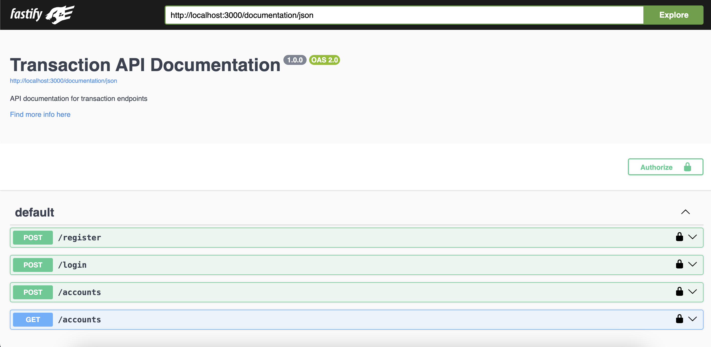
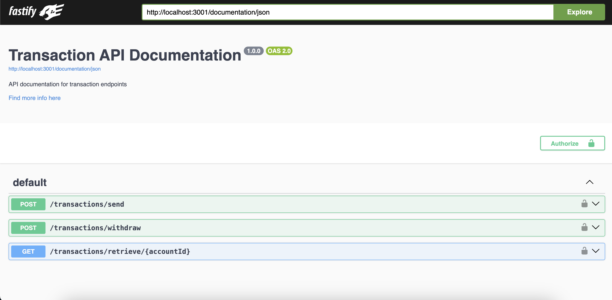

# System Requirements

Before installing and running the services, ensure that your system meets the following requirements:

- Node.js: Version 18.x or higher
- npm (Node Package Manager): Version 8.x or higher
- Docker Engine
- Docker Compose

# Docker Compose Installation

## Installation
1. Clone the repository:

    ```bash
    git clone <repository_url>
    ```

2. Navigate to the root directory of the project:

    ```bash
    cd <project_directory>
    ```
3. Create a `.env` file in the root directory of the project. Add the following environment variables to the `.env` file:

    ```plaintext
    SUPEBASE_URL=<Supabase_URL>
    SUPEBASE_API_KEY=<Supabase_API_KEY>
    MONGO_URI_PAYMENT=<MongoDB_URI_FOR_PAYMENT>
    MONGO_URI_ACCOUNT=<MongoDB_URI_FOR_ACCOUNT>
    ```

    Replace `<Supabase_URL>`, `<Supabase_API_KEY>`, `<MongoDB_URI_FOR_PAYMENT>`, and `<MongoDB_URI_FOR_ACCOUNT>`  with your actual Supabase URL, Supabase API key, and MongoDB URI respectively.


3. Build and run the Docker containers for both services:

    ```bash
    docker-compose up
    ```

4. The Account Service will start running at `http://localhost:3000`.
   The Payment Service will start running at `http://localhost:3001`.

## Swagger Documentation

### Account Service

To access the Swagger documentation for the Account Service API, visit the following link:

[http://localhost:3000/documentation](http://localhost:3000/documentation)



### Payment Service

To access the Swagger documentation for the Payment Service API, visit the following link:

[http://localhost:3001/documentation](http://localhost:3001/documentation)



### Live Demo API
- [http://100.27.230.100:3000/documentation/](http://100.27.230.100:3000/documentation/)
- [http://100.27.230.100:3001/documentation/](http://100.27.230.100:3001/documentation/)


# Manual Installation

## Account Service

The Account Service is responsible for managing user accounts, including registration, login, and account creation.

### Installation

1. Clone the repository:

    ```bash
    git clone <repository_url>
    ```

2. Navigate to the `account` directory:

    ```bash
    cd account
    ```

3. Install dependencies:

    ```bash
    npm install
    ```

### Configuration

1. Create a `.env` file in the root directory of the `account`.

2. Add the following environment variables to the `.env` file:

    ```plaintext
    SUPEBASE_URL=<Supabase_URL>
    SUPEBASE_API_KEY=<Supabase_API_KEY>
    MONGO_URI=<MongoDB_URI>
    ```

    Replace `<Supabase_URL>`, `<Supabase_API_KEY>`, and `<MongoDB_URI>` with your actual Supabase URL, Supabase API key, and MongoDB URI respectively.

### Usage

1. Start the Account Service:

    ```bash
    npm start
    ```

2. The Account Service will start running at `http://localhost:3000`.

### Swagger Documentation

To access the Swagger documentation for the Account Service API, visit the following link:

[http://localhost:3000/documentation](http://localhost:3000/documentation)


### Live Demo API
[http://100.27.230.100:3000/documentation/](http://100.27.230.100:3000/documentation/)


## Payment Service

The Payment Service is responsible for processing and managing transactions.

### Installation

1. Clone the repository:

    ```bash
    git clone <repository_url>
    ```

2. Navigate to the `payment` directory:

    ```bash
    cd payment
    ```

3. Install dependencies:

    ```bash
    npm install
    ```

### Configuration

1. Create a `.env` file in the root directory of the `payment`.

2. Add the following environment variables to the `.env` file:

    ```plaintext
    SUPEBASE_URL=<Supabase_URL>
    SUPEBASE_API_KEY=<Supabase_API_KEY>
    MONGO_URI=<MongoDB_URI>
    ```

    Replace `<Supabase_URL>`, `<Supabase_API_KEY>`, and `<MongoDB_URI>` with your actual Supabase URL, Supabase API key, and MongoDB URI respectively.

### Usage

1. Start the Payment Service:

    ```bash
    npm start
    ```

2. The Payment Service will start running at `http://localhost:3001`.

### Swagger Documentation

To access the Swagger documentation for the Payment Service API, visit the following link:

[http://localhost:3001/documentation](http://localhost:3001/documentation)


### Live Demo API
[http://100.27.230.100:3001/documentation/](http://100.27.230.100:3001/documentation/)
